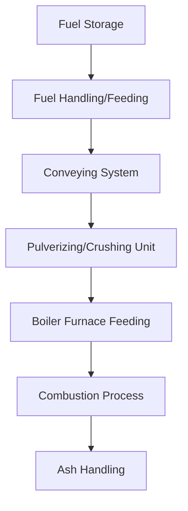

#core 

| **Unit** | **Syllabus**                                                                                                                                                                                                                                                                                                                                                                    |
| -------- | ------------------------------------------------------------------------------------------------------------------------------------------------------------------------------------------------------------------------------------------------------------------------------------------------------------------------------------------------------------------------------- |
| 1        | Indian energy scenario, Indian coals: formation, properties, analysis, benefication and heating value calculation of coals; coking and non-coking coals, fuel handling systems; coal gasification. Classification of power plants, base load and Peak load power stations, co-generated power plant, captive power plant, and their fields of application & selection criteria. |
| 2        | **Steam Generators**: High pressure utility boiler, natural and forced circulation, coking and non-coking coal, coal benefication, coal pulverization, pulverized fuel firing system, combustion process, need of excess air, cyclone furnace, fluidized bed boiler, electrostatic precipitators and wet scrubbers, boiler efficiency calculations, water treatment.            |
| 3        | **Combined Cycle Power Plants**: Binary vapour cycles, coupled cycles, gas turbine- steam turbine power plant, gas pipe line control, MHD-Steam power plant.                                                                                                                                                                                                                    |
| 4        | **Other power plants**: Nuclear power plants - working and types of nuclear reactors, boiling water reactor, pressurized water reactor, fast breeder reactor, controls in nuclear power plants, hydro power plant -classification and working of hydroelectric power plants, tidal power plants, diesel and gas power plants.                                                   |
| 5        | **Instrumentation and Controls in power plants**: Important instruments used for temperature, flow, pressure, water/steam conductivity measurement; flue gas analysis, drum level control, combustion control, super heater and re-heater temperature control, furnace safeguard and supervisory system (FSSS), auto turbine run-up system(ATRS).                               |
| 6        | **Environment Pollution and Energy conservation**: Economics of power generation: load duration curves, power plant economics, pollution from power plants, disposal/management of nuclear power plant waste, concept of energy conservation and energy auditing.                                                                                                               |

---
# Important Questions MIDSEM
### 1. Explain the Indian energy scenario and discuss the various factors to be considered for selection of power plants.

**Indian Energy Scenario:**

- **Rapidly Growing Demand:**  
  Economic growth and industrialization are driving up energy needs.
- **Energy Mix:**  
	- **Coal Dominance:** About 70% of electricity comes from coal, due to abundant domestic reserves.  
	- **Rising Renewables:** Increased investment in solar, wind, hydro, and nuclear to diversify the mix and reduce emissions.
- **Government Initiatives:**  
  Policies like the National Solar Mission and grid modernization efforts are key to transitioning towards cleaner and more sustainable energy.
- **Challenges:**  
  Balancing energy security with environmental concerns and managing fuel logistics are major issues.

**Factors for the Selection of Power Plants:**

- **Economic Considerations:**  
  Evaluate capital costs, operational expenses, and fuel costs/availability. The payback period and overall efficiency play crucial roles.
- **Technical and Operational Factors:**  
  Consider the plant’s efficiency, reliability, and suitability for load demands (base load vs. peak load). Quick start-up and flexibility are important for peak load plants, while base load plants are designed for continuous operation.
- **Environmental and Regulatory Factors:**  
  Compliance with emission standards, the overall environmental impact, and necessary permits. Cleaner technologies might have higher upfront costs but lower environmental liabilities.
- **Fuel and Resource Considerations:**  
  Availability of fuel (coal, gas, renewable sources) locally, and the existing infrastructure for transportation and storage are key factors.
- **Strategic Considerations:**  
  Energy security, future expansion or upgrade potential, and grid compatibility are important for long-term planning.

### 2. Describe the layout and working principle of a steam power plant with a neat sketch. Explain the functions of major components.

 **Layout and Working Principle of a Steam Power Plant**

A steam power plant converts the thermal energy from fuel combustion into electrical energy through a closed-loop thermodynamic cycle (known as the *Rankine cycle*). The main components are arranged in a loop that continuously circulates water/steam.

**Neat Sketch of a Steam Power Plant**

![[Screenshot 2025-03-04 at 9.18.50 PM.png]]

**Working Principle**

Heating water in a boiler to create high-pressure steam, which then expands through a turbine to generate mechanical energy that is converted into electricity by a generator; the exhausted steam is then condensed back into water and returned to the boiler to repeat the cycle, essentially using the heat energy from burning fuel to produce electricity through the expansion of steam.

**Functions of Major Components**

- **Boiler/Furnace:**
    - **Function:** Converts water into steam by burning fuel.
    - **Key Elements:** Economizer (preheats water), Furnace (combustion chamber), Superheater (raises steam temperature).
- **Steam Turbine:**
    - **Function:** Converts the thermal energy of steam into mechanical energy by allowing the steam to expand and drive the turbine blades.
- **Generator:**
    - **Function:** Transforms the mechanical energy from the turbine into electrical energy through electromagnetic induction.
- **Condenser:**
    - **Function:** Cools and condenses the spent steam into water, maintaining a low-pressure environment to enhance turbine efficiency.
- **Feed water Pump:**
    - **Function:** Pressurizes the condensate to push it back into the boiler, completing the cycle.

### 3. Compare base load and peak load power stations. Discuss their merits and demerits.

**Base Load Power Stations**
Plants designed to run continuously, supplying a constant minimum load.

- **Examples:**
    Coal-fired, nuclear, large hydro, and combined cycle power plants.
- **Merits:**
    - **High Efficiency at Full Load:** They are optimized for continuous operation, offering lower cost per unit of electricity.
    - **Reliability:** Provide a stable, predictable supply of power essential for the grid’s minimum demand.
- **Demerits:**
    - **Inflexibility:** Slow to start up or shut down, making them unsuitable for rapidly changing demand.
    - **High Capital Costs:** Often require significant upfront investment.

**Peak Load Power Stations**
Plants that operate only during periods of high demand or emergencies.

- **Examples:**
    Gas turbines, diesel generators, and open-cycle gas turbines.
- **Merits:**
    - **Operational Flexibility:** Quick start-up and shut down, ideal for handling fluctuations in demand.
    - **Lower Capital Investment:** Generally cheaper to build compared to base load plants.
- **Demerits:**
    - **Higher Operational Costs:** They usually have lower efficiency and higher fuel costs per unit of electricity generated.
    - **Limited Use:** Not designed for continuous operation, making them less cost-effective if run for long periods.

### 4. Explain the working principle of pulverized coal firing system with a neat sketch. Discuss its advantages and disadvantages.

**Working Principle**

1. **Pulverization:**
   Coal is ground into a fine powder in a pulverizer, significantly increasing its surface area.
2. **Mixing with Air:**
   The fine coal particles are mixed with preheated air in the coal-air mixer, forming a combustible mixture.
3. **Injection into Furnace:**
   The coal-air mixture is injected into the boiler furnace through specially designed burners.
4. **Combustion:**
   In the furnace, the finely pulverized coal ignites and burns rapidly. The high surface area ensures quick and complete combustion, releasing heat.
5. **Steam Generation:**
   The heat from combustion is absorbed by water tubes within the boiler, converting water into high-pressure steam. This steam drives a turbine connected to a generator to produce electricity.

**Neat Sketch**

![[Screenshot 2025-03-04 at 9.57.32 PM.png | 600]]

**Advantages**

- **Efficient Combustion:**
  Fine pulverization leads to rapid and complete combustion.
- **Uniform Flame:**
  Provides stable and uniform heat release.
- **Lower Emissions:**
  Complete combustion reduces unburnt carbon and particulate emissions.
- **Quick Response:**
  Able to adjust rapidly to changes in load demand.
- **Compact Furnace Design:**
  Faster combustion allows for smaller furnace sizes.

**Disadvantages**

- **High Energy Consumption:**
  Energy-intensive pulverization process.
- **Maintenance Requirements:**
  Pulverizers and burners need regular maintenance.
- **Explosion Hazard:**
  Fine coal dust increases the risk of dust explosions if not managed properly.
- **Higher Capital Cost:**
  Initial investment is higher due to specialized equipment.
- **Fuel Quality Sensitivity:**
  Performance can be affected by the coal's moisture and ash content.

### 5. Describe the working of a fluidized bed combustion boiler. What are its benefits over conventional boilers?

**Working Principle of a Fluidized Bed Combustion Boiler**

A fluidized bed combustion (FBC) boiler burns fuel in a bed of hot, inert particles (such as sand or limestone) that are suspended or “fluidized” by a stream of air. This provides excellent mixing of fuel and air, resulting in more uniform and efficient combustion.

**Key Steps in the Process**

1. **Air Distribution:**
    Preheated air is introduced from below through a distributor plate, fluidizing the bed material and creating a turbulent, mixing environment.
2. **Fuel Injection:**
    Solid fuels (coal, biomass, etc.) are fed into the fluidized bed. The fine particles of fuel mix thoroughly with the inert bed material.
3. **Combustion:**
    In the fluidized state, the fuel burns at relatively low temperatures (typically around 850–900°C). The bed maintains uniform temperature, ensuring complete combustion.
4. **Emission Control:**
    Limestone or other sorbents can be added to the bed to react with sulfur dioxide ($SO_2$), reducing pollutant emissions.
5. **Heat Transfer:**
    Heat generated from combustion is absorbed by water tubes immersed in the bed, producing high-pressure steam for power generation.

**Neat Sketch**

![[Screenshot 2025-03-04 at 10.33.00 PM.png]]

**Benefits over Conventional Boilers**

- **Fuel Flexibility:**
    Can efficiently burn low-grade fuels (high moisture/ash content) and biomass, broadening fuel options.
- **Lower Combustion Temperature:**
    Operating at lower temperatures reduces $NO_X$ formation and minimizes slagging and fouling.
- **Enhanced Combustion Efficiency:**
    Excellent mixing in the fluidized bed leads to more complete and uniform combustion.
- **In-Situ Emission Control:**
    Sorbents like limestone can be added directly into the bed to capture sulfur, reducing $SO_2$ emissions.
- **Improved Heat Transfer:**
    The turbulent mixing ensures better heat transfer to the water tubes, improving overall efficiency.

### 6. Explain the Rankine cycle with relevant diagrams. How can its efficiency be improved?

The Rankine cycle is the fundamental thermodynamic cycle used in steam power plants to convert heat energy into mechanical work, which then drives a generator to produce electricity. It involves four main processes:

1. **Pumping (Process 1-2):**
    Liquid water is pressurized by a pump, raising its pressure with minimal temperature increase.
2. **Heat Addition in the Boiler (Process 2-3):**
    The high-pressure water enters the boiler where it is heated at constant pressure to become high-pressure, superheated steam.
3. **Expansion in the Turbine (Process 3-4):**
    The superheated steam expands through a turbine, producing work as its pressure and temperature drop.
4. **Condensation (Process 4-1):**
    The low-pressure steam is condensed back into liquid water in a condenser, releasing the remaining heat to a cooling medium.

 ![[Screenshot 2025-03-05 at 12.51.12 PM.png]]

**Improving the Efficiency of the Rankine Cycle**

- **Superheating:**
    Increasing the temperature of the steam beyond its saturation point in the boiler increases the thermal efficiency and reduces moisture content at the turbine exit.
- **Reheat Cycle:**
    Partially expanding the steam in the turbine, then reheating it in the boiler before further expansion helps in maintaining a higher average temperature during heat addition, improving efficiency.
- **Regenerative Feedwater Heating:**
    Extracting some steam from the turbine to preheat the feedwater increases the temperature of the water entering the boiler, reducing the fuel required for heating.
- **Lower Condenser Pressure:**
    Operating the condenser at a lower pressure increases the pressure difference during expansion, thus enhancing the cycle's work output and efficiency.
- **Combined Cycle:**
    Integrating the Rankine cycle with other cycles (e.g., gas turbine cycle) can utilize waste heat, significantly boosting overall plant efficiency.

### 7. Discuss the effects of superheating and reheating in steam power plants.

**Superheating**
Superheating involves heating saturated steam further in a superheater, raising its temperature above the saturation point.

- **Effects:**
    - **Increased Efficiency:**  
        Higher temperature steam improves the thermal efficiency of the Rankine cycle.
    - **Reduced Moisture Content:**  
        Drier steam minimizes moisture formation in the turbine, reducing blade erosion and prolonging turbine life.
    - **Higher Enthalpy:**  
        Superheated steam carries more energy per unit mass, leading to greater work output during expansion.

**Reheating**
Reheating is the process of partially expanding steam in the turbine, then sending it back to the boiler to be heated again before further expansion.

- **Effects:**
    - **Enhanced Efficiency:**  
        Maintaining a higher average temperature during expansion improves the overall cycle efficiency.
    - **Moisture Reduction:**  
        Reheating decreases the moisture content in the later stages of turbine expansion, further protecting turbine blades.
    - **Increased Power Output:**  
        The process allows for additional work extraction, leading to higher power generation.
    - **Thermal Stress Mitigation:**  
        Reduces the thermal gradients in the turbine, thereby lessening mechanical stress and wear.

Both these practices help improve plant's performance, efficiency, and life.

### 8. Explain the working principle of combined cycle power plants. why are they becoming increasingly important?

**Working Principle of Combined Cycle Power Plants**
A combined cycle power plant integrates two thermodynamic cycles to maximize fuel efficiency:

1. **Gas Turbine (Brayton Cycle):**
    - **Process:** Air is compressed, then mixed with fuel in a combustor and ignited.
    - **Output:** The high-temperature, high-pressure gases expand in a gas turbine, generating mechanical work.
2. **Heat Recovery Steam Generator (HRSG):**
    - **Process:** The exhaust gases from the gas turbine, which still contain significant heat, are passed through an HRSG.
    - **Output:** The recovered heat converts water into steam. Hence, special boilers.
3. **Steam Turbine (Rankine Cycle):**
    - **Process:** The steam produced in the HRSG is expanded through a steam turbine, generating additional power.
    - **Cycle Closure:** After expansion, the steam is condensed and the water is pumped back to the HRSG, completing the cycle.

![[Pasted image 20250305161006.png]]

> 1. **Combustion Chamber** (C.C.): burns fuel with compressed air, producing high-temperature, high-pressure gases that flow into the **Gas Turbine** (GT).
> 2. **Heat Recovery Steam Generator** (HRSG): Waste heat from GT is used to convert water from pump to steam that flows into **Steam Turbine** (ST).
> 3. **Generator** (G).

**Why Combined Cycle Power Plants Are Becoming Increasingly Important**

- **High Efficiency:**
    They achieve overall thermal efficiencies over 60% by utilizing waste heat from the gas turbine, compared to 35–40% in conventional steam plants.
- **Lower Emissions:**
    Improved efficiency means lower fuel consumption and reduced CO₂ and pollutant emissions per unit of electricity generated.
- **Economic Advantages:**
    Reduced fuel usage leads to lower operating costs and better economic viability, making them competitive in today's energy markets.
- **Operational Flexibility:**
    They can adjust power output to meet varying load demands, which is valuable for grid stability.
- **Environmental and Regulatory Benefits:**
    Their cleaner operation helps meet stringent environmental regulations, aligning with global trends toward reducing greenhouse gas emissions.

### 9. Describe the layout and working of a nuclear power plant. Explain the different types of nuclear reactors.

**Layout and Working of a Nuclear Power Plant**

1. **Reactor Core:**
    - Contains nuclear fuel (usually uranium or plutonium) arranged in fuel assemblies.
    - Control rods (made of neutron-absorbing materials) are inserted/withdrawn to control the fission chain reaction.
    - The core is moderated (using water or heavy water) to slow down neutrons for sustained fission.
2. **Coolant System:**
    - A coolant (typically water, heavy water, or liquid metal) circulates through the reactor core to absorb the heat produced by fission.
3. **Heat Transfer:**
    - **In PWRs:** The hot primary coolant transfers its heat to a secondary water circuit via a steam generator without direct contact.
    - **In BWRs:** Water in the reactor is allowed to boil; the generated steam directly drives the turbine.
4. **Turbine and Generator:**
    - The steam produced drives a turbine connected to a generator, converting thermal energy into electrical energy.
5. **Condenser and Feedwater System:**
    - After passing through the turbine, the steam is condensed back into water in a condenser.
    - The condensate is then pumped back to the steam generator or reactor, completing the cycle.
6. **Containment Structure:**
    - A robust, airtight structure encloses the reactor and associated systems to prevent any release of radioactivity.

![[Screenshot 2025-03-05 at 5.18.50 PM.png]]

**Different Types of Nuclear Reactors**

1. **Pressurized Water Reactor (PWR):**
    - **Coolant/Moderator:** Light water maintained under high pressure.
    - **Operation:** Water in the primary loop is kept from boiling; heat is transferred to a secondary loop in a steam generator.
    - **Usage:** Most common reactor type globally.
2. **Boiling Water Reactor (BWR):**
    - **Coolant/Moderator:** Light water that boils directly in the reactor vessel.
    - **Operation:** The generated steam is directly used to drive the turbine, eliminating the need for a separate steam generator.
3. **Pressurized Heavy Water Reactor (PHWR/CANDU):**
    - **Coolant/Moderator:** Heavy water (D₂O).
    - **Operation:** Uses natural uranium as fuel; offers on-line refuelling and greater fuel flexibility.
4. **Fast Breeder Reactor (FBR):**
    - **Coolant:** Often uses liquid metal (e.g., sodium) instead of water.
    - **Operation:** Uses fast neutrons to convert fertile material (like uranium-238) into fissile material (plutonium-239), generating more fuel than consumed.
5. **Advanced Gas-Cooled Reactor (AGR):**
    - **Coolant/Moderator:** Carbon dioxide as coolant and graphite as moderator.
    - **Operation:** Uses uranium dioxide fuel in pressure tubes; primarily found in the United Kingdom.

### 10. Calculate efficiency, work output, or heat rates for given steam cycle parameters (numerical problem).

##### **Basic Theory**

1. **Rankine Cycle Overview:**
    - The Rankine cycle is used in steam power plants to convert heat into work (electricity).
    - Key components include a boiler (where water is turned into steam), a turbine (where steam expands to produce work), a condenser (where steam is turned back into water), and a pump (to recycle the water).
    - In many exam problems, the pump work is considered negligible.
2. **Isentropic Expansion:**
    - When steam expands in the turbine, the process is often assumed to be isentropic (i.e., the entropy remains constant).
    - This helps us find the quality of steam (the ratio of vapor to total mass) at the turbine exit using the steam table values.

##### **Key Formulas and Their Meanings**

**Turbine Work Output:**
- **Formula:**
$$W_{turbine} = h_1 - h_2$$
- **Explanation:**
	$h_1$ is the enthalpy of steam at the turbine inlet, and $h_2$ is the enthalpy at the turbine exit. Their difference represents the energy converted to work.

**Heat Input:**
- **Formula:**
$$Qin=h1−h_{feedwater}$$
- **Explanation:**
	$h_1$ is the steam enthalpy coming out of the boiler, and $h_{\text{feedwater}}$ is the enthalpy of water entering the boiler. This difference is the energy added to the cycle.

**Thermal Efficiency:**
- **Formula:**
$$\eta = \frac{W_{\text{net}}}{Q_{\text{in}}}$$
- **Explanation:**
	The efficiency is the ratio of the net work output (usually taken as the turbine work when pump work is negligible) to the heat input.

**Heat Rate:**
- **Formula:**
$$\text{Heat Rate} = \frac{Q_{\text{in}}}{W_{\text{net}}} \times 3600 \quad \text{(in kJ/kWh)}$$

- **Explanation:**
	This shows how much heat energy is required to produce one unit of electrical energy. The multiplication by 3600 converts the units from kJ per kJ to kJ per kWh.

**Determining Steam Quality (for Isentropic Expansion):**
- **Formula:**
$$s_1 = s_f + x (s_g - s_f)$$
- **Explanation:**
	Here, $s_1$ is the entropy at the turbine inlet, $s_f$ and $s_g$ are the entropies of the saturated liquid and vapor at the turbine exit pressure, and $x$ is the steam quality (fraction of vapor). Once $x$ is known, you can find $h_2$ using:
$$h_2 = h_f + x (h_g - h_f)$$

##### **Sample Problem**

A simple Rankine cycle operates under the following conditions:

- **Boiler (State 1):** Steam is generated at 10 MPa and 600°C.
- **Turbine Exit (State 2):** Steam expands isentropically to 0.1 MPa.
- **Assumption:** Pump work is negligible.

Using approximate steam table data:

- **At 10 MPa and 600°C:**
    - $h_1 \approx 3580\ \text{kJ/kg}$
    - $s_1 \approx 6.50\ \text{kJ/kg·K}$
- **At 0.1 MPa (saturated conditions):**
    - Saturated liquid enthalpy, $h_f \approx 417\ \text{kJ/kg}$
    - Saturated vapor enthalpy, $h_g \approx 2584\ \text{kJ/kg}$
    - Saturated liquid entropy, $s_f \approx 1.10\ \text{kJ/kg·K}$
    - Saturated vapor entropy, $s_g \approx 7.50\ \text{kJ/kg·K}$

**Tasks:**

1. Determine the turbine exit enthalpy $h_2$.
2. Calculate the net work output per kg of steam.
3. Compute the thermal efficiency of the cycle.
4. Determine the heat rate (in kJ/kWh).

##### **Step-by-Step Solution**

**1. Turbine Expansion (State 1 to State 2)**

Since the expansion is isentropic:
$$
s_1 = s_2
$$

At 0.1 MPa, let the quality of the steam be $x$. Then:
$$
s_2 = s_f + x(s_g - s_f)
$$

Solving for $x$:
$$
x = \frac{s_1 - s_f}{s_g - s_f} = \frac{6.50 - 1.10}{7.50 - 1.10} = \frac{5.40}{6.40} \approx 0.844
$$

Now, determine the enthalpy at turbine exit $h_2$:
$$
h_2 = h_f + x(h_g - h_f)
$$
Substitute the values:
$$
h_2 = 417 + 0.844 \times (2584 - 417)
$$
$$
h_2 = 417 + 0.844 \times 2167 \approx 417 + 1828 \approx 2245\ \text{kJ/kg}
$$

**2. Turbine Work Output**

Turbine work per kg of steam is given by:
$$
W_{\text{turbine}} = h_1 - h_2 = 3580 - 2245 \approx 1335\ \text{kJ/kg}
$$

**3. Heat Input and Thermal Efficiency**

Assuming the feedwater enters the boiler at nearly the condensate condition $h \approx 417\ \text{kJ/kg}$, the heat input is:
$$
Q_{\text{in}} = h_1 - h_{\text{feedwater}} = 3580 - 417 = 3163\ \text{kJ/kg}
$$

Thermal efficiency $\eta$ is:
$$
\eta = \frac{W_{\text{net}}}{Q_{\text{in}}} \approx \frac{1335}{3163} \approx 0.422\ \text{or}\ 42.2\%
$$

**4. Heat Rate**

Heat rate is the amount of heat input required per unit of work output. In kJ per kWh, it is calculated as:
$$\text{Heat Rate} = \left(\frac{Q_{\text{in}}}{W_{\text{net}}}\right) \times 3600 = \left(\frac{3163}{1335}\right) \times 3600 \approx 2.37 \times 3600 \approx 8532\ \text{kJ/kWh}$$

##### **Result**

- **Turbine Exit Enthalpy $h_2$:** ~2245 kJ/kg
- **Net Work Output:** ~1335 kJ/kg
- **Thermal Efficiency:** ~42.2%
- **Heat Rate:** ~8532 kJ/kWh

---
# MIDSEM SHIT THEORY

## UNIT 1: INDIAN ENERGY SCENARIO & COAL TECHNOLOGIES

### Indian Energy Scenario and Coal

- Per capita energy consumption in India is low compared to developed countries (4% of USA, 20% of world average).
- Energy demand expected to increase over next 10-15 years.
- Coal remains dominant fuel for power generation.

### Coal in India

- India has world's 4th largest coal reserves
- Coal accounts for 55% of country's energy needs
- Gondwana coal makes up 98% of total reserves and 99% of production
- Indigenous coal production needs expansion to meet future demand

### Coal Formation and Properties

- Factors determining coal composition:
    - Accumulation and burial of plant debris
    - Age and geographical distribution of deposits
    - Structure and chemical composition of coal-forming plants
    - Nature and intensity of peat decaying agencies

### Coal Types and Analysis

- Coking coal (metallurgical coal):
    - High carbon content (60-90%)
    - Low ash content
    - Used for coke production in iron and steel industry
- Non-coking coal (thermal coal):
    - Lower carbon content (40-70%)
    - Higher ash content
    - Used for power generation and industrial fuel

![[Screenshot 2025-03-07 at 2.40.45 AM.png]]
### Coal Beneficiation

- Process to improve coal quality by reducing ash content
- Important for enhancing coal's heating value and reducing emissions
- **Coal Beneficiation Processes:**
    - **Gravity Separation:** Uses differences in density to separate coal from impurities.
    - **Flotation:** Exploits differences in surface properties (hydrophobicity) to remove mineral matter.
    - **Magnetic Separation:** Utilizes magnetic properties of certain impurities to clean the coal.
### Heating Value Calculation

- **Bomb Calorimeter:** Measures the heat released during combustion of a coal sample.
- **Empirical Formulas (e.g., Dulong’s Formula):** Estimate heating value from the elemental composition. (carbon, hydrogen, sulfur, and ash content)

### Coal Gasification

- Process of producing syngas (CO, H2, CO2, CH4).
- Involves blowing coal with oxygen and steam under heat and pressure.
- Used for in-situ gasification and in coal refineries.
- **Types of Gasifiers:**
	- **Fixed-Bed Gasifiers:** Simple design for coarser fuels.
	- **Fluidized-Bed Gasifiers:** Offer better mixing, suitable for low-grade coal.
	- **Entrained-Flow Gasifiers:** Operate at very high temperatures and are used for fine coal particles.
- **Syngas Composition:** Mainly consists of CO, H₂, CO₂, and CH₄, which can be used for power generation or chemical synthesis.

### Fuel Handling System

1. **Fuel Storage:** The starting point where fuel is stored.
2. **Fuel Handling/Feeding:** Prepares the fuel by conditioning and sizing it.
3. **Conveying System:** Transports the fuel to the processing stage.
4. **Pulverizing/Crushing Unit:** Processes the fuel (especially coal) into a fine powder.
5. **Boiler Furnace Feeding:** Delivers the processed fuel into the furnace.
6. **Combustion Process:** The fuel is burned to produce steam.
7. **Ash Handling:** Manages the residual ash produced from combustion.

### Power Plant Classification

- **Base load power plants:**
    - Operate continuously
    - Include hydroelectric, nuclear, and steam power plants
    - Have high load factors and low operating costs
- **Peak load power plants:**
    - Supply fluctuating demand
    - Include gas turbine and pumped storage plants
    - Quick starting and loading capability

### Co-generation and Captive Power Plants

- **Co-generation**: Simultaneous production of electricity and useful heat
- **Captive** power plants:
    - Localized power generation for industrial facilities or large offices
    - Can operate in grid parallel or island mode
    - Improve energy security and efficiency.

### Classification of Power Plants

- **By Energy Source:**
    - **Thermal:** Uses fossil fuels (coal, gas, oil) or biomass.
    - **Nuclear:** Utilizes nuclear reactions for heat.
    - **Hydro:** Employs water flow to generate power.
    - **Renewable:** Includes solar, wind, geothermal, etc.
- **By Operating Mode:**
    - **Base Load Plants:** Run continuously to meet constant demand.
    - **Intermediate/Load-Following Plants:** Adjust output as demand fluctuates.
    - **Peak Load Plants:** Operate during periods of highest demand.
- **By Ownership/Usage:**
    - **Utility Power Plants:** Serve public grid requirements.
    - **Captive Power Plants:** Set up by industries for self-consumption.
    - **Co-generated (CHP) Plants:** Produce both electricity and useful heat.

### Base Load and Peak Load Power Stations

- **Base Load Power Stations:**
    - **Operation:** Run continuously (24/7) to supply the constant minimum demand.
    - **Examples:** Coal-fired, nuclear, large hydroelectric.
    - **Selection Criteria:** High efficiency at full load, lower operational cost, long-term stability.
- **Peak Load Power Stations:**
    - **Operation:** Activated during high demand periods; may run intermittently.
    - **Examples:** Gas turbines, diesel engines, open cycle gas turbines.
    - **Selection Criteria:** Quick start-up, flexible operation, higher efficiency during peak hours, lower capital cost relative to intermittent use.

### Co-Generated (Combined Heat and Power - CHP) Plants

- **Definition:**
    Plants that simultaneously produce electricity and capture waste heat for additional applications.
- **Benefits:**
    - **Higher Efficiency:** Utilizes energy that would otherwise be wasted.
    - **Cost Savings:** Reduces energy costs for industries or district heating systems.
    - **Environmental:** Lower emissions due to improved fuel utilization.
- **Fields of Application:**
    - Industrial processes (e.g., refineries, paper mills).
    - District heating and cooling systems.
    - Commercial complexes with simultaneous heat and power requirements.
- **Selection Criteria:**
    - Proximity to thermal energy demand.
    - Availability of a steady fuel supply.
    - Economic viability based on both electricity and heat demand.

### Captive Power Plants

- **Definition:**  
    Power plants built by industries or large establishments to generate electricity primarily for their own use.
- **Advantages:**
    - **Reliability:** Ensures a stable and uninterrupted power supply.
    - **Cost Control:** Mitigates risks associated with grid power fluctuations and tariffs.
    - **Customization:** Tailored to specific load requirements of the facility.
- **Fields of Application:**
    - Manufacturing industries (e.g., steel, cement, textiles).
    - Large commercial complexes and institutions.
    - Remote locations with unreliable grid connectivity.
- **Selection Criteria:**
    - Energy consumption patterns and load profile.
    - Cost-effectiveness compared to grid purchase.
    - Regulatory and environmental considerations.
    - Fuel availability and logistics.

### Overall Selection Criteria for Power Plant Types

- **Economic Factors:**
    - Capital investment vs. operational cost.
    - Payback period and return on investment.
- **Technical Factors:**
    - Plant efficiency and reliability.
    - Flexibility in ramping up or down.
    - Compatibility with available fuel types.
- **Environmental and Regulatory Factors:**
    - Emission norms and pollution control.
    - Regulatory approvals and environmental impact assessments.
- **Operational Factors:**
    - Load demand profile (base, intermediate, or peak).
    - Proximity to consumption points.
    - Fuel supply stability and infrastructure availability.

## UNIT 2: STEAM GENERATORS & BOILER TECHNOLOGIES

### Natural vs. Forced Circulation Boilers

- **Natural Circulation:**
    - Relies on the density difference between heated (steam–water mix) and cooler water to drive circulation.
    - Simpler design with no circulation pumps, but less effective in very high-capacity or high-pressure boilers.
- **Forced Circulation:**
    - Uses pumps to force the water–steam mixture through the boiler tubes.
    - Allows for higher operating pressures and capacities, with more controlled circulation.

### Cyclone Furnace

- **Working Principle:**
    - Pulverized coal and air are introduced tangentially to create a cyclone effect.
    - This enhances fuel–air mixing, leading to more efficient and complete combustion.
- **Advantages:**
    - Improved flame stability and combustion efficiency.
    - Reduced formation of pollutants due to better mixing.

### Emission Control Devices

- **Electrostatic Precipitators (ESPs):**
    - **Function:** Remove fine particulate matter from flue gases by charging the particles and collecting them on oppositely charged plates.
    - **Key Benefit:** High removal efficiency for particulate pollutants.
- **Wet Scrubbers:**
    - **Function:** Use a scrubbing liquid (often water with additives) to capture particulates and gaseous pollutants.
    - **Key Benefit:** Effective for removing both particulates and soluble gases like SO₂.

### Boiler Efficiency Calculations

- **Heat Loss Analysis:**
    - Efficiency is determined by comparing the heat input (fuel energy) to the useful heat absorbed (steam generation).
    - Losses include radiation, convection, incomplete combustion, and unaccounted heat in flue gases.
- **Efficiency Formula:**
$$\eta = \frac{\text{Useful Heat Output}}{\text{Total Heat Input}} \times 100\%$$
- Often determined experimentally or through energy balance calculations.

### Water Treatment in Boilers

- **Purpose:**
    - Prevents scale formation, corrosion, and deposition of impurities.
- **Common Treatments:**
    - **Demineralization:** Removes dissolved minerals from feedwater.
    - **Chemical Additives:** Such as oxygen scavengers and pH adjusters to protect boiler metal surfaces.
    - **Filtration and Softening:** Reduces suspended solids and hardness.

## UNIT 3: COMBINED CYCLE & ADVANCED POWER PLANT CYCLES

### Binary Vapour Cycles

- **Concept:**
    - Uses two fluids with different boiling points.
    - The primary fluid generates vapor from low-grade heat, which then transfers energy to a secondary working fluid for power production.
- **Application:**
    - Particularly useful in geothermal or low-temperature waste heat recovery systems.

### Coupled Cycles

- **Definition:**
    - Integration of two or more thermodynamic cycles to maximize overall efficiency.
    - Example: Combining a gas turbine (Brayton cycle) with a steam turbine (Rankine cycle) in a combined cycle power plant.

### Gas Pipeline Control in Power Plants

- **Role:**
    - Ensures stable and efficient fuel gas supply to gas turbines.
    - Involves regulating gas pressure, flow rate, and composition.
- **Importance:**
    - Critical for maintaining turbine performance and overall plant efficiency.

### MHD-Steam Power Plants

- **Magnetohydrodynamic (MHD) Generation:**
    - **Working Principle:**
        - Uses the high-temperature, ionized gas (plasma) produced by burning fuel.
        - This plasma flows through a magnetic field, generating electrical power directly by electromagnetic induction.
    - **Follow-on Steam Cycle:**
        - The exhaust heat from the MHD generator is then used to produce steam, driving a conventional steam turbine.
- **Advantages and Challenges:**
    - **Advantages:** Potential for very high efficiency and lower emissions.
    - **Challenges:** High technological complexity and material constraints at extreme temperatures.

---
# UNIT 4 - ENDGAME

## 1. Nuclear Power Plants

### 1.1 How It Works: From Atom to Steam

1. **Fission Reaction**
	* A neutron hits a uranium‑235 nucleus → it splits into two smaller nuclei + 2–3 neutrons + \~200 MeV of heat.
	* Those extra neutrons go on to split more nuclei (chain reaction), as long as enough fuel and neutrons remain.
2. **Key Components & Flow**
	* **Fuel Rods:** Ceramic UO₂ pellets in long metal tubes (“fuel assemblies”).
	* **Moderator:** Usually light water; slows neutrons so fission stays efficient.
	* **Control Rods:** Made of boron or cadmium; inserted to soak up neutrons (slows/stops fission).
	* **Coolant Loop:** Hot water (or liquid sodium) circulates through the core, picks up heat, and carries it away.
	* **Steam Side (PWR vs BWR):**
		* **PWR:** Coolant stays liquid under \~155 bar. It flows through a **steam generator** to boil water in a separate loop → steam spins the turbine.
		* **BWR:** Coolant boils right inside the reactor vessel at \~70 bar. That steam, after moisture separation, goes straight to the turbine.
	* **Containment Building:** Thick concrete/steel “shell” around the reactor vessel to trap any radioactive leaks.
3. **Safety & Shutdown**
	* **Scram (Emergency Shutdown):** All control rods slam in within seconds.
	* **Emergency Core Cooling:** Backup pumps or gravity‑fed water flood the core if pressure or flow drops.
	* **Containment Spray:** Cools and filters any gases before venting.

### 1.2 Reactor Types at a Glance

| Feature               | BWR                                 | PWR                                 | FBR                                  |
| --------------------- | ----------------------------------- | ----------------------------------- | ------------------------------------ |
| **Where steam forms** | Inside reactor vessel               | In separate steam generator         | In steam generator after sodium loop |
| **Typical pressure**  | \~70 bar                            | \~155 bar                           | \~0.5–1.5 bar (steam side)           |
| **Coolant**           | Light water                         | Light water                         | Liquid sodium                        |
| **Pros**              | Fewer heat‑exchangers, simpler loop | Radioactivity confined; proven tech | Breeds more fuel (Pu‑239)            |
| **Cons**              | Radio‑active steam lines            | High pressure → thick walls         | Sodium reacts with air/water         |

## 2. Hydroelectric Power Plants

### 2.1 Types by Storage & Head

* **Storage (Reservoir):** Big dam creates lake; release water on demand.
* **Run‑of‑River:** Little storage—power follows river flow hour‑to‑hour.
* **Pumped‑Storage:** Two reservoirs at different elevations—pump up at night, generate in day.

**Hydraulic Head Categories**

* **Low‑head:** < 30 m → Kaplan turbines (adjustable blades).
* **Medium‑head:** 30–300 m → Francis turbines (mixed‑flow).
* **High‑head:** > 300 m → Pelton turbines (impulse jets).

### 2.2 How a Reservoir Plant Operates

1. **Intake & Trashrack:** Screens out debris.
2. **Penstock:** Water falls through a large pipe—gains pressure proportional to height drop.
3. **Surge Tank:** A buffer to absorb sudden pressure changes (“water hammer”).
4. **Turbine & Generator:** High‑pressure water spins the turbine blades; the connected generator makes electricity.
5. **Draft Tube & Tailrace:** Slows water down smoothly back to the river.

> **Power Formula:**
> $P = \eta\,\rho\,g\,Q\,H$,
> where
> • η = overall efficiency (85–95 %),
> • ρ = water density (1 000 kg/m³),
> • g = 9.81 m/s²,
> • Q = flow rate (m³/s),
> • H = net head (m).

## 3. Tidal Power Plants

### 3.1 Main Schemes

1. **Tidal Barrage:** Dam across estuary with turbines in the gates.
2. **Tidal Stream Turbines:** Underwater “windmills” in strong tidal currents.
3. **Tidal Lagoons / Dynamic T‑Dams:** Enclosed areas or long perpendicular piers that harness phase differences without full blockage.

### 3.2 Barrage Operation Steps

1. **Flood Phase:** Gates open as tide rises; basin fills.
2. **Hold Phase:** Gates close at high tide—stores potential energy.
3. **Ebb Generation:** Water released through turbines as tide falls → electricity.
4. **(Optional) Two‑Way:** Run turbines on both in‑flow and out‑flow with reversible runners.

> **Energy per Cycle:**
> $\displaystyle E = \tfrac12\,\rho\,g\,A\,R^2$
> where
> • A = basin area,
> • R = tidal range (m).

## 4. Diesel & Gas Power Plants

### 4.1 Diesel Engine‑Generator Sets

* **Four‑Stroke Cycle:** Intake → Compression → Combustion → Exhaust.
* **Fuel Injection:** High‑pressure spray auto‑ignites in hot compressed air.
* **Typical Efficiency:** 35–45 %.
* **Use Cases:** Emergency backup, remote locations, peaking power.

### 4.2 Gas Turbines

#### A. Simple (Open) Cycle

1. **Compressor:** Pressurizes air to \~15–25 bar.
2. **Combustion Chamber:** Burns gas at \~1 300–1 600 °C.
3. **Turbine:** Extracts work—drives compressor & generator.
4. **Exhaust:** Hot gases vent out (sometimes to provide heat to nearby buildings).

* **Efficiency:** 30–40 %. Fast start, compact.

#### B. Combined Cycle (CCGT)

* **HRSG:** Captures turbine exhaust (\~550 °C) to make steam.
* **Steam Turbine:** Generates extra power.
* **Overall Efficiency:** 50–60 %.

## 5. Quick Comparison & When to Use What

| Plant Type        | Key Advantage                          | Main Drawback                        |
| ----------------- | -------------------------------------- | ------------------------------------ |
| Nuclear (PWR)     | Very high output, low fuel cost        | High capital & safety systems        |
| Hydro (Reservoir) | Low running cost, long life            | Depends on geography & rainfall      |
| Tidal Barrage     | Predictable, renewable                 | Very high upfront cost, local impact |
| Gas (CCGT)        | High efficiency, moderate capital cost | CO₂ emissions, needs gas supply      |
| Diesel GenSets    | Extremely fast start, flexible sizing  | High fuel cost, high emissions       |

---
# UNIT 5

## 1. Measurement Instruments

| Measured Variable                                                     | Common Instruments                                                    |
| --------------------------------------------------------------------- | --------------------------------------------------------------------- |
| **Temperature**                                                       | • Thermocouple (TC)                                                   |
| • Resistance Temperature Detector (RTD)                               |                                                                       |
| • Infrared Pyrometer                                                  | • TC: Seebeck effect; wide range (–200 to +1 800 °C), rugged          |
| • RTD: Resistance vs. temperature; high accuracy, limited to \~600 °C |                                                                       |
| • Pyrometer: Non‑contact; for burners, superheater outlets            |                                                                       |
| **Flow (Water/Steam/Fuel/Oil)**                                       | • Orifice Plate / Venturi / Nozzle                                    |
| • Turbine Flowmeter                                                   |                                                                       |
| • Electromagnetic Flowmeter                                           |                                                                       |
| • Coriolis Mass Flowmeter                                             | • Differential pressure across restriction → volumetric flow          |
| • Turbine: Rotational speed ∝ flow; simple                            |                                                                       |
| • Magnetic: Faraday’s law; for conductive fluids                      |                                                                       |
| • Coriolis: Mass flow directly; highest accuracy                      |                                                                       |
| **Pressure (Gauge, Differential)**                                    | • Bourdon Tube Gauge                                                  |
| • Diaphragm / Capsule                                                 |                                                                       |
| • Strain‑gauge Transducer                                             |                                                                       |
| • Piezoelectric Sensor                                                | • Mechanical deflection (Bourdon/diaphragm) → pointer / strain gauge  |
| • Strain gauge: electrical signal, good for DCS                       |                                                                       |
| • Piezo: dynamic pressure (rapid transients)                          |                                                                       |
| **Level (Drum, Condensate, Fuel)**                                    | • Differential Pressure Level                                         |
| • Capacitance Level Probe                                             |                                                                       |
| • Float‐and‐Displacer (Mag‐Float)                                     |                                                                       |
| • Ultrasonic / Radar Level                                            | • DP: head difference between top & bottom taps                       |
| • Capacitive: dielectric constant change                              |                                                                       |
| • Mag‑float: simple, robust for steam drums                           |                                                                       |
| • Ultrasonic/Radar: non‑contact, for closed vessels                   |                                                                       |
| **Conductivity (Water/Steam)**                                        | • Two‑electrode                                                       |
| • Four‑electrode (Toroidal)                                           |                                                                       |
| • Inductive Conductivity Probe                                        | • 2‑electrode: inexpensive, polarization issues                       |
| • 4‑electrode: mitigates polarization, wide range                     |                                                                       |
| • Inductive: no direct contact; measures high‑purity water            |                                                                       |
| **Pressure & Draft in FGD / ESP**                                     | • Aspirated Pitot Tube                                                |
| • Baffle & Orifice for draft measurement                              | • Draft control essential for boiler heat‑balance and ESP performance |
| **Flue Gas Analysis**                                                 | • Electrochemical O₂ Cell                                             |
| • NDIR CO₂ Analyzer                                                   |                                                                       |
| • Chemiluminescence NOₓ Analyzer                                      |                                                                       |
| • Paramagnetic O₂ Analyzer                                            | • O₂: measures excess air; drives combustion control                  |
| • NDIR CO₂/CO: infrared absorption bands                              |                                                                       |
| • NOₓ: chemiluminescence from NO + O₃ → NO₂\* → emission              |                                                                       |

---

## 2. Drum Level Control

### 2.1 Why It Matters

* **Steam‑water separation:** Too low level → expose tubes, loss of steam quality; too high → carry‑over and turbine erosion.

### 2.2 Control Strategies

| Scheme             | Inputs                              | Control Action                               | Pros / Cons                                     |
| ------------------ | ----------------------------------- | -------------------------------------------- | ----------------------------------------------- |
| **Single‑Element** | Drum level (downcomer DP)           | Control feedwater flow                       | Simple; poor disturbance rejection              |
| **Two‑Element**    | Drum level + steam flow             | Feedwater valve + feed‑pump                  | Better at load changes; no steam temp feedback  |
| **Three‑Element**  | Drum level + steam flow + feed flow | Cascade: level controller sets flow setpoint | Best disturbance rejection; handles flash tanks |

* **Implementation:**

  1. Level transmitter(s) feed into cascaded PID loops.
  2. Feedwater control valve modulates water flow.
  3. Boiler feed pumps follow valve demand.

---

## 3. Combustion Control

### 3.1 Objective

Maintain optimal fuel–air ratio to maximize efficiency, minimize CO/NOₓ and prevent unburnt fuel.

### 3.2 Control Loops & Instruments

1. **Drum‑Pressure Control**

   * Boiler drum pressure → master setpoint for fuel flow.

2. **Fuel Flow Control**

   * **Firing Rate:** Controlled via pulverizer feed (coal mills) or fuel oil/gas valves.
   * **Fuel Flow Measurement:** Flowmeters on pulverized coal (DP type), fuel oil (mass or volumetric).

3. **Air Flow Control**

   * **Primary Air (PA):** Carries pulverized coal; DP flowmeters + dampers.
   * **Secondary Air (SA):** For complete combustion; measured by orifice or vane‑axial flow.
   * **Over‑Fire Air (OFA):** Adjusted to stage combustion, reduce NOₓ.

4. **O₂ Trim Loop**

   * **O₂ Analyzer** in flue gas → PID trim to SA flow or FD (forced draft) fan speed → maintain 2–3 % O₂.

5. **Excess Air Control**

   * Master–slave configuration:

     * Master loop: drum pressure → firing rate
     * Slave loop: O₂ trim on SA damper

---

## 4. Superheater & Reheater Temperature Control

### 4.1 Importance

* Protect tubes from overheating.
* Ensure steam meets turbine inlet spec (temp, dryness).

### 4.2 Control Methods

1. **Spray (Desuperheater) Control**

   * **Water Spray Nozzles** downstream of superheater tubes.
   * **Control Loop:**

     * **PV:** Superheater outlet T (thermocouples)
     * **MV:** Spray water flow (control valve) → inject water to desuperheat.
   * **Considerations:**

     * Water quality (use condensate, deaerated water).
     * Fast‑acting valves to avoid temperature oscillations.

2. **Bypass Control**

   * Divert a portion of steam around superheater or reheater.
   * **Control Valve** on bypass line regulates fraction.

3. **Gas‑Side Dampers**

   * Modulate flue‐gas flow through superheater banks.

---

## 5. Furnace Safeguard & Supervisory System (FSSS)

### 5.1 Purpose

Protect against unsafe furnace conditions, prevent explosions, tube damage.

### 5.2 Key Functions & Instruments

| Function                      | Instrument / Device                                             |
| ----------------------------- | --------------------------------------------------------------- |
| **Flame Detection**           | UV / IR Flame Scanners; Photocells                              |
| **High/Low Temperature Trip** | Thermocouple arrays in furnace walls                            |
| **Gas Leakage**               | Combustible gas detectors in burner areas                       |
| **Over‑Pressure Protection**  | Furnace pressure transmitters + safety relief vents             |
| **Burner Management Logic**   | Interlocks for sequencing: pilot light → main flame → ID fan    |
| **Supervisory Logic**         | PLC/DCS with hardwired safety relays → reactor shutdown or trip |

* **Sequence Enforcement:** Ensure correct order (purge → ignition → flame prove → to full firing).
* **Interlocks & Trips:** Once a critical fault (e.g., loss of flame, over‑temperature) is detected, shut off fuel supply and initiate emergency purge.

---

## 6. Auto Turbine Run‑Up System (ATRS)

### 6.1 Objective

Provide safe, automated start‑up, synchronization and loading of steam (or gas) turbines.

### 6.2 Main Stages

1. **Lube Oil & Hydraulic System Checks**

   * Verify oil pressure, temperature, filter status.

2. **Rolling & Warm‑Up**

   * **Start Motor / Turning Gear:** Slowly rotate shaft to distribute oil, warm bearings.
   * Monitor bearing temperature.

3. **Accelerating to Turning Gear Speed**

   * Control feedwater & steam admission (for steam turbines) via control valves.

4. **Speed Control & Governors**

   * **Hydraulic or Electronic Governor:** Follows speed setpoint ramp (e.g. 0 – 3 000 rpm in defined secs).
   * **Sequence Control** via DCS/PLC.

5. **Synchronization**

   * **Sync‑Check Relay:** Verifies phase, voltage, frequency match with grid.
   * **Auto‑Sync Controller:** Closes breaker at zero‑phase angle difference.

6. **Loading**

   * **Load Setter:** Ramp generator load to target MW/MVar according to grid/Q demands.

7. **Interlocks & Protection**

   * Overspeed trip, low oil pressure, vibration monitors, thrust bearing position.

---

### 7. General Control Architecture

* **DCS (Distributed Control System):**

  * Houses PID loops, interlocks, permits operator override, trend logging.
* **PLC / Safety I\&C:**

  * Hardwired safety logic (SIS) for FSSS, overspeed, high/low trips.
* **SCADA / HMI:**

  * Operator panels, mimic diagrams, alarms, historical trends.

---

### Key Exam Tips

1. **Know Instrument Principles:** Be able to sketch an orifice plate DP cell, explain Seebeck vs. RTD behavior.
2. **Loop Tuning:** Recall P, PI, PID roles; effects of gain, integral and derivative terms.
3. **Control Schematics:** Practice drawing three‑element drum level control and O₂ trim loops.
4. **Trip Logic:** Summarize FSSS interlock sequences in a table or flowchart.
5. **Safety vs. Regulatory:** Distinguish between alarm (alert) and trip (automatic shutdown).

These notes, combined with hand‑drawn diagrams of control loops and instrument installations, will give you confidence in any instrumentation or controls question. Good luck!

# UNIT 6

## 1. Economics of Power Generation

### 1.1 Load Duration Curves (LDC)

* **Definition:** A plot of system load (power demand) sorted in descending order against time (hours in a year).
* **Construction Steps:**

  1. Record load at short intervals (e.g., every 15 min) over a year → 8,760 data points.
  2. Sort demands from highest to lowest.
  3. Plot demand (y‑axis) vs. cumulative hours (x‑axis).
* **Key Features:**

  * **Base‑load Region:** Leftmost flat section—high‐capacity, low‐cost plants run continuously.
  * **Mid‑merit Region:** Middle—intermediate‐cost units meet variable load.
  * **Peaking Region:** Rightmost steep tail—peaking units (e.g., gas turbines) run few hours.
* **Uses:**

  * Optimal capacity mix: match plant types to segments.
  * Estimate annual energy production by area under curve for each plant capacity.
  * Calculate **Plant Utilization Factor (CUF)**:

    $$
    \text{CUF} = \frac{\text{Annual energy generated}}{\text{Installed capacity} \times 8760}\times100\%
    $$

### 1.2 Power Plant Economics

* **Cost Categories:**

  1. **Fixed (Capital) Costs:**

     * **Investment Cost (IC):** Plant construction, land, finance.
     * **Interest During Construction (IDC)**
     * **Fixed O\&M Cost:** Salaries, insurance, taxes (independent of output).
  2. **Variable Costs:**
     * **Fuel Cost (FC):** $C_f \times \text{fuel consumption}$.
     * **Variable O\&M:** Consumables, minor maintenance (proportional to run hours).
* **Levelized Cost of Electricity (LCOE):**
  $$
  \text{LCOE} = \frac{\sum_t (I_t + F_t + O_t)}{\sum_t E_t}
  $$
  where $I_t$=annualized investment, $F_t$=fuel cost, $O_t$=O\&M cost, $E_t$=energy generated.
* **Tariff Components:**

  * **Capacity Charge:** Covers fixed costs; paid on declared capacity.
  * **Energy Charge:** Based on actual units generated; covers fuel & variable costs.
* **Economic Dispatch:**

  * Rank committed units by short‐run marginal cost (SRMC = fuel + variable O\&M).
  * Dispatch lowest‐cost units first to meet load stepwise.

---

## 2. Pollution from Power Plants

### 2.1 Thermal (Coal/Oil/Gas) Plants

* **Air Emissions:**

  * **SO₂:** From sulfur in fuel → acid rain, respiratory issues.
  * **NOₓ:** Thermal, fuel, and prompt NOₓ → photochemical smog, ozone.
  * **Particulate Matter (PM):** Fly ash, soot → health impacts.
  * **CO₂:** Greenhouse gas—climate change.
* **Control Technologies:**

  * **Electrostatic Precipitator (ESP) / Bag Filters:** Remove fly ash.
  * **Flue Gas Desulfurization (FGD):** Wet limestone/gypsum process for SO₂.
  * **Selective Catalytic Reduction (SCR):** Ammonia injection over catalyst for NOₓ.
  * **Low‑NOₓ Burners, Over‑fire Air:** Reduce NOₓ formation.
* **Water Pollution:**

  * **Thermal Discharge:** Elevated water temperature → aquatic stress.
  * **Effluent Contaminants:** Oil, grease, heavy metals, treatment‐plant discharge.
* **Solid Waste:**

  * **Fly Ash & Bottom Ash:** Reuse in cement, brick, landfill.
  * **Slag:** From coal gasification or integrated gasification CC.

### 2.2 Nuclear Power Plants

* **Routine Releases:**

  * **Gaseous:** Noble gases (Xe, Kr), small tritium.
  * **Liquid:** Low‐activity coolant effluent (diluted).
* **Radiological Impact Controls:**

  * **Containment Structures, HEPA Filters, Delay Tanks.**
  * **ALARA Principle:** Keep exposures “As Low As Reasonably Achievable.”

---

## 3. Disposal & Management of Nuclear Waste

### 3.1 Waste Classification

1. **Low‐Level Waste (LLW):** Contaminated clothing, filters.
2. **Intermediate‐Level Waste (ILW):** Resins, reactor components.
3. **High‐Level Waste (HLW):** Spent fuel assemblies, vitrified waste.

### 3.2 Management Strategies

* **Onsite Handling:**

  * Cooling pools for spent fuel (years).
  * Interim storage in dry casks (steel/concrete).
* **Processing & Conditioning:**

  * **Vitrification:** HLW immobilized in borosilicate glass.
  * **Encapsulation:** Cement/inert matrix for ILW.
* **Final Disposal:**

  * **Near‐Surface Facilities:** LLW trenches or engineered vaults.
  * **Deep Geological Repositories:** HLW/ILW in stable rock formations (\~500 m depth), multiple barriers (waste form, canister, buffer, host rock).

### 3.3 Safeguards & Monitoring

* **Radiation Monitoring:** Continuous surveillance of air, water, soil.
* **Institutional Controls:** Access restrictions, waste tracking.
* **Post‐Closure Assessments:** Performance modeling for >10⁴ years.

---

## 4. Energy Conservation & Energy Auditing

### 4.1 Concept of Energy Conservation

* **Definition:** Reducing energy consumption through efficient technologies & behavior change without sacrificing service.
* **Strategies:**

  * **Demand‐Side Management (DSM):** Peak load shifting, interruptible tariffs.
  * **Efficient Equipment:** High‐efficiency motors, LED lighting, variable‐speed drives.
  * **Behavioral Measures:** Awareness campaigns, thermostat setbacks.

### 4.2 Energy Audit

* **Purpose:** Identify energy use patterns, inefficiencies, savings opportunities.
* **Types of Audit:**

  1. **Preliminary (Walk‐through) Audit:** Visual inspection, utility bill analysis.
  2. **Detailed (General) Audit:** Submetering, data logging, process analysis.
  3. **Investment‐Grade Audit:** Detailed cost–benefit, project feasibility.
* **Audit Steps:**

  1. **Data Collection:** Historical energy bills, process maps.
  2. **Site Survey:** Measure flows, temperatures, equipment performance.
  3. **Data Analysis:** Baseline energy consumption, benchmarking.
  4. **Identify Measures:** Technical (e.g., heat recovery), operational, organizational.
  5. **Financial Analysis:** Simple payback, NPV, IRR.
  6. **Report:** Recommendations, implementation plan, monitoring.

### 4.3 Key Performance Indicators (KPIs)

* **Specific Energy Consumption (SEC):** kWh/unit production.
* **Energy Use Index (EUI):** kWh/m²·year for buildings.
* **Load Factor:** Average load/peak load.
* **Power Factor Improvement:** Corrective capacitors or synchronous condensers.

---

### 5. Exam‑Ready Tips

* **LDC Sketch:** Practice drawing and labeling all regions.
* **Cost Calculations:** Be comfortable deriving LCOE and tariff splits.
* **Pollution Control Flowsheets:** Sketch FGD, ESP, SCR.
* **Waste Management Diagrams:** Draw multi‐barrier repository concept.
* **Audit Case Study:** Work through a small boiler or compressed‐air system audit.
